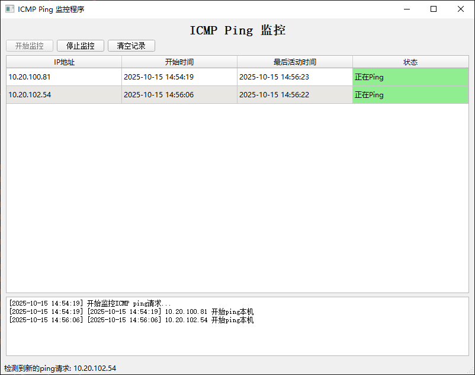

# ICMP Ping 监控程序


## 功能说明

本程序用于监控所有对本机的ICMP Echo请求（ping操作），并实时显示相关信息：
1. 显示开始ping本机的IP地址和时间
2. 当IP停止ping时显示停止时间
3. 实时显示ping状态



### 特色功能
- 🖥️ **多种界面**：命令行和图形界面版本
- 🎨 **状态可视化**：用颜色区分正在ping和已停止ping的主机
- 🔄 **实时监控**：实时检测和显示ICMP请求
- 🔧 **跨平台**：支持Windows、Linux和macOS
- 🚀 **易于使用**：提供启动脚本自动获取所需权限

项目包含以下文件：
- `icmp_monitor.py`: 主要的监控程序（需要管理员权限和Scapy支持）
- `simple_icmp_monitor.py`: 简化版本，使用系统命令监控
- `gui_icmp_monitor.py`: 图形界面版本，使用PyQt5显示实时监控信息
- `icmp_monitor.ps1`: PowerShell版本的监控脚本

## 环境要求

- Python 3.6+
- Scapy库
- 管理员权限（Windows）
- 数据包捕获驱动（Windows需要npcap或winpcap）

## 安装步骤

### 1. 安装Python依赖

```bash
pip install scapy
```

### 2. 安装数据包捕获驱动（Windows）

在Windows系统上，需要安装npcap或winpcap来支持数据包捕获功能：

1. 下载并安装npcap：
   - 访问 https://nmap.org/npcap/
   - 下载最新版本的npcap安装包
   - 运行安装程序，选择"Install Npcap in WinPcap API-compatible Mode"

或者安装winpcap：
   - 访问 https://www.winpcap.org/
   - 下载并安装winpcap

## 使用方法

### 方法1: 使用主要监控程序（推荐）

#### Windows系统

1. 以管理员身份打开命令提示符（CMD）或PowerShell
2. 运行程序：
   ```bash
   python icmp_monitor.py
   ```
3. 程序将开始监控ICMP请求
4. 按 `Ctrl+C` 停止监控

#### Linux/macOS系统

1. 在终端中运行：
   ```bash
   sudo python icmp_monitor.py
   ```
2. 输入管理员密码
3. 程序将开始监控ICMP请求
4. 按 `Ctrl+C` 停止监控

### 方法2: 使用图形界面版本

图形界面版本提供了更直观的显示方式，用不同颜色标注ping状态：

#### Windows系统

1. 双击运行 `run_gui_monitor.bat` 文件（会自动请求管理员权限）
   
或者手动以管理员身份运行：
1. 以管理员身份打开命令提示符（CMD）或PowerShell
2. 运行程序：
   ```bash
   python gui_icmp_monitor.py
   ```

#### Linux/macOS系统

1. 在终端中运行启动脚本：
   ```bash
   sudo ./run_gui_monitor.sh
   ```
   
或者手动运行：
1. 在终端中运行：
   ```bash
   sudo python3 gui_icmp_monitor.py
   ```

#### 图形界面操作说明

1. 点击"开始监控"按钮开始监控
2. 程序将显示图形界面，实时更新ping状态
3. 正在ping的主机显示为绿色背景
4. 已停止ping的主机显示为红色背景
5. 点击"停止监控"按钮停止监控
6. 点击"清空记录"按钮清空历史记录

### 方法3: 使用简化版本

如果主要程序无法正常运行，可以使用简化版本：
```bash
python simple_icmp_monitor.py
```

### 方法4: 使用PowerShell脚本（仅Windows）

在PowerShell中运行：
```powershell
.\icmp_monitor.ps1
```

## GitHub项目信息

本项目托管在GitHub上，欢迎贡献！

### 项目结构
```
icmp-monitor/
├── icmp_monitor.py          # 命令行版本主程序
├── gui_icmp_monitor.py      # 图形界面版本主程序
├── simple_icmp_monitor.py   # 简化版本
├── icmp_monitor.ps1         # PowerShell脚本版本
├── run_gui_monitor.bat      # Windows启动脚本
├── run_gui_monitor.sh       # Linux/macOS启动脚本
├── requirements.txt         # 项目依赖
├── README.md               # 项目说明文档
├── LICENSE                 # 开源许可证
├── CHANGELOG.md            # 更新日志
├── CONTRIBUTING.md         # 贡献指南
├── CODE_OF_CONDUCT.md      # 行为准则
├── SECURITY.md             # 安全政策
└── .github/
    └── workflows/
        ├── test.yml        # 测试工作流
        └── release.yml     # 发布工作流
```

### 贡献

欢迎提交Issue和Pull Request！请查看[贡献指南](CONTRIBUTING.md)了解详情。

### 许可证

本项目采用MIT许可证，详情请查看[LICENSE](LICENSE)文件。

## 输出示例

```
ICMP Ping 监控程序
=====================
功能说明:
1. 监控所有对本机的ICMP Echo请求(ping)
2. 显示开始ping的IP地址和时间
3. 当IP停止ping时显示停止时间
4. 实时显示ping状态

使用说明:
- 需要以管理员权限运行此程序
- 需要安装Scapy库 (pip install scapy)
- 按 Ctrl+C 停止监控

开始监控ICMP ping请求...
按 Ctrl+C 停止监控
[2023-10-15 14:30:25] 192.168.1.100 开始ping本机
[2023-10-15 14:30:30] 192.168.1.105 开始ping本机
[2023-10-15 14:30:35] 192.168.1.100 停止ping本机
```

## 注意事项

1. 必须以管理员权限运行程序，否则无法捕获网络数据包
2. 如果未安装npcap/winpcap，程序将无法正常工作
3. 程序仅监控ICMP Echo请求，不处理其他类型的网络流量
4. 程序会自动检测停止ping的主机，并在3秒内更新状态
5. 简化版本功能有限，建议优先使用完整版本
6. 图形界面版本需要安装PyQt5库：`pip install pyqt5`
7. Windows系统建议使用 `run_gui_monitor.bat` 启动脚本自动获取管理员权限
8. Linux/macOS系统需要使用 `sudo` 运行程序

## 故障排除

### 1. "权限被拒绝"错误

确保以管理员权限运行程序。

### 2. "winpcap未安装"错误

安装npcap或winpcap驱动程序。

### 3. 程序无输出

检查是否有其他设备正在ping本机，或者尝试从另一台设备ping本机进行测试。

### 4. 权限问题

如果遇到权限问题，可以尝试使用简化版本或PowerShell脚本。

### 5. 图形界面显示问题

如果图形界面版本无法正常显示，确保已安装PyQt5：
```bash
pip install pyqt5
```

### 6. 启动脚本权限问题

在Linux/macOS系统上，确保启动脚本具有执行权限：
```bash
chmod +x run_gui_monitor.sh
```

## 开发

### 本地开发环境设置

1. 克隆仓库：
   ```bash
   git clone https://github.com/yourusername/icmp-monitor.git
   cd icmp-monitor
   ```

2. 安装依赖：
   ```bash
   pip install -r requirements.txt
   ```

3. 运行程序：
   ```bash
   # 命令行版本
   python icmp_monitor.py
   
   # 图形界面版本
   python gui_icmp_monitor.py
   ```
